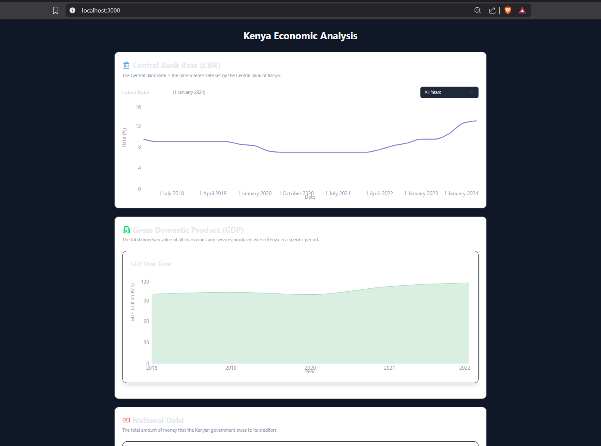
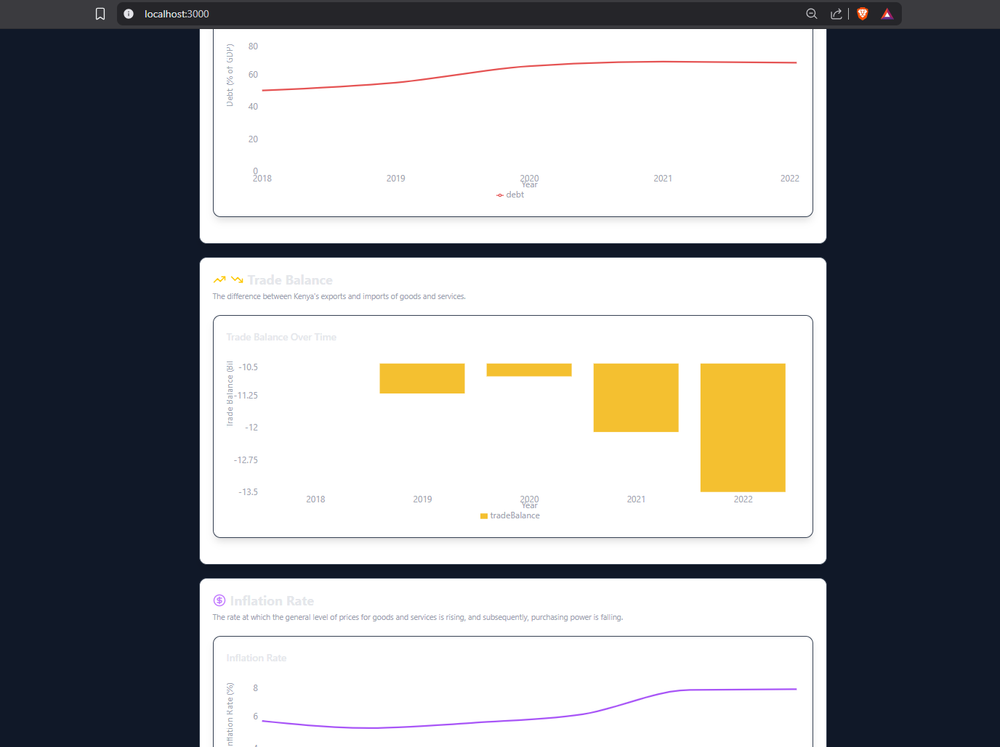

# Kenya Economy Analysis App

The **Kenya Economy Analysis App** is a React-based web application designed to provide a simple visualization of Kenya's economic indicators. The app is itended to fetches real-time and historical data from various sources and presents it in an interactive and user-friendly interface (to be implemented later). It allows users to explore trends, compare metrics, and gain insights into Kenya's economic performance.

## Features

- **Central Bank Rate (CBR):** Visualize the historical trends of the Central Bank of Kenya's base interest rate.
- **Gross Domestic Product (GDP):** Analyze Kenya's GDP growth over the years.
- **National Debt:** Track the country's debt as a percentage of GDP.
- **Trade Balance:** Explore the difference between Kenya's exports and imports.
- **Inflation Rate:** View the inflation trends and their impact on purchasing power.
- **Unemployment Rate:** Examine the unemployment rate trends in Kenya.


## Technologies Used

- **React:** For building the user interface.
- **TypeScript:** For type safety and better developer experience.
- **Recharts:** For creating interactive and customizable charts.
- **Framer Motion:** For smooth animations and transitions.
- **Tailwind CSS:** For styling the application.
- **Lucide Icons:** For visually appealing icons.

## How the webapp looks
Below is a screenshot of the shown in first image. The app is designed to be responsive and user-friendly, allowing users to easily navigate through different economic indicators and visualize the data effectively.


The second image shows other indicators that are not shown in the first image. The app is designed to be responsive and user-friendly, allowing users to easily navigate through different economic indicators and visualize the data effectively.


## Prerequisites
- Node.js (v14 or later)
- npm (Node Package Manager)
- A modern web browser (Chrome, Firefox, Safari, etc.)
- Basic knowledge of React and TypeScript is recommended but not required.
- An internet connection to fetch real-time data from APIs.
- A code editor (e.g., Visual Studio Code) for development and customization.


## Getting Started

## How to Run the Project

1. Clone the repository:
   ```bash
   git clone https://github.com/dennis-kachila/kenya-economy-app.git
   ```

2. Navigate to the project directory:
   ```bash
   cd kenya-economy-analysis
   ```

3. Install dependencies:
   ```bash
   npm install
   ```

4. Start the development server:
   ```bash
   npm run dev
   ```

5. Open the app in your browser:
   ```
   http://localhost:3000
   ```

## Future Enhancements
- implement real-time data fetching from APIs.
- Add more economic indicators such as foreign exchange rates and poverty levels.
- Enable exporting charts as images or PDFs.
- Integrate predictive analytics for forecasting trends.


## Contributing

Contributions are welcome! If you'd like to contribute, please fork the repository and submit a pull request with your changes.


This is a [Next.js](https://nextjs.org) project bootstrapped with [`create-next-app`](https://nextjs.org/docs/app/api-reference/cli/create-next-app).

## Getting Started

First, run the development server:

```bash
npm run dev
# or
yarn dev
# or
pnpm dev
# or
bun dev
```

Open [http://localhost:3000](http://localhost:3000) with your browser to see the result.

You can start editing the page by modifying `app/page.tsx`. The page auto-updates as you edit the file.

This project uses [`next/font`](https://nextjs.org/docs/app/building-your-application/optimizing/fonts) to automatically optimize and load [Geist](https://vercel.com/font), a new font family for Vercel.

## Learn More

To learn more about Next.js, take a look at the following resources:

- [Next.js Documentation](https://nextjs.org/docs) - learn about Next.js features and API.
- [Learn Next.js](https://nextjs.org/learn) - an interactive Next.js tutorial.

You can check out [the Next.js GitHub repository](https://github.com/vercel/next.js) - your feedback and contributions are welcome!

## Deploy on Vercel

The easiest way to deploy your Next.js app is to use the [Vercel Platform](https://vercel.com/new?utm_medium=default-template&filter=next.js&utm_source=create-next-app&utm_campaign=create-next-app-readme) from the creators of Next.js.

Check out our [Next.js deployment documentation](https://nextjs.org/docs/app/building-your-application/deploying) for more details.


## License

This project is licensed under the [MIT License](LICENSE).

## Acknowledgments

- Data sources: Central Bank of Kenya, World Bank, and other reliable economic data providers.
- Libraries and frameworks: React, Recharts, Tailwind CSS, and Framer Motion.

---
**Author:** Dennis Kachila  
**Contact:** denniskachila4332@gmail.com